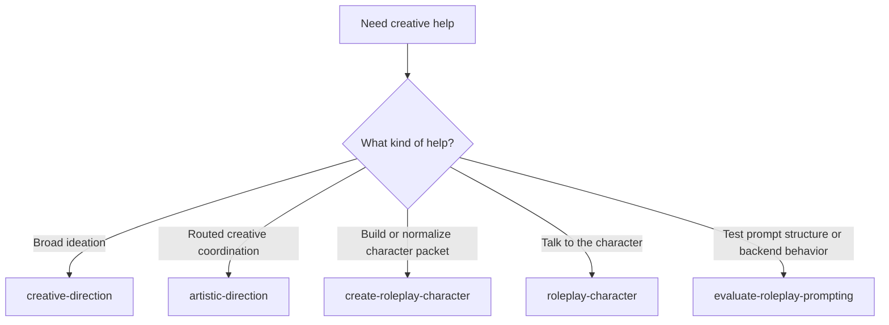

# Creative And Roleplay Prompt Surface Reference

**Audience:** users and prompt authors choosing between the current creative, roleplay, and prompt-evaluation entry points.

**Scope:** a durable reference for when to use each prompt in the creative and roleplay subsystem.

The current surface intentionally separates four kinds of work:

1. broad ideation
2. creative direction and character-packet orchestration
3. in-character enactment
4. prompt-structure evaluation

## Prompt selection table

| Prompt | Use it when | Avoid it when |
|---|---|---|
| `creative-direction` | You want broad lateral ideation, critique, or stylistic reframing outside the roleplay-character workflow | You need character-packet assembly or in-character chat |
| `artistic-direction` | You want the broad front door for concept, voice, composition, or routed creative coordination | You already know the task is roleplay packet design, pure enactment, or pure prompt evaluation |
| `create-roleplay-character` | You want a new character, substantive redesign, or normalization of user-supplied character notes into a roleplay-ready packet | You already have a stable packet and only want to talk to the character |
| `roleplay-character` | You want to talk to the character in scene using an existing packet | You want to redesign the character or compare prompt structures |
| `evaluate-roleplay-prompting` | You want to compare packet formats, steering techniques, prompt structures, or backend-facing prompt behavior | You want direct creative design or live in-character enactment |

## Practical split

### Broad ideation

Use `creative-direction` when the main job is exploratory creativity:

- themes
- names
- symbols
- artistic angles
- abstract reframing

This lane is intentionally separate from the roleplay packet workflow.

### Creative orchestration

Use `artistic-direction` when the task needs routing or synthesis across:

- concept
- voice
- composition

If the real job is to design or normalize a roleplay-ready packet, route onward to `create-roleplay-character` as the explicit packet owner.

This is the right front door when the user is not sure which creative specialist should own the next slice.

### Character creation and normalization

Use `create-roleplay-character` when the output should be a roleplay-ready packet.

That includes both:

- new character design
- normalization of mostly-specified notes into a stable packet

The packet shape is documented in [roleplay-character-packet-template.md](roleplay-character-packet-template.md).

### Enactment

Use `roleplay-character` when the packet is already ready enough to act on.

This prompt is for:

- in-character dialogue
- compact scene narration
- continuity updates such as scene summary or recent interaction state

It is not for redesigning identity, traits, motives, or the relationship model.

### Prompt lab

Use `evaluate-roleplay-prompting` when the job is to test prompt structure rather than to author the character.

Typical prompt-lab questions:

- does this packet shape improve consistency?
- do few-shot examples help more than late-turn steering here?
- does reply-boundary wording reduce spillover?
- how does this behave on a local backend such as Ollama?

The evaluation criteria are documented in [roleplay-prompt-evaluation-rubric.md](roleplay-prompt-evaluation-rubric.md).

## Minimal workflow map

## Redundancy rules

To keep the surface clean:

- `creative-direction` should not become the default roleplay entry point
- `roleplay-character` should not become a design prompt
- `evaluate-roleplay-prompting` should not turn into character creation
- `create-roleplay-character` should own both new packet design and normalization, so a second design-side roleplay prompt is unnecessary

When those lines hold, the current prompt surface stays discoverable without multiplying near-duplicates.